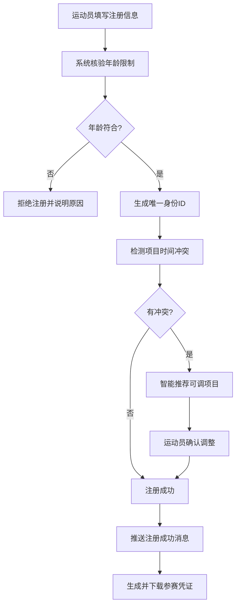
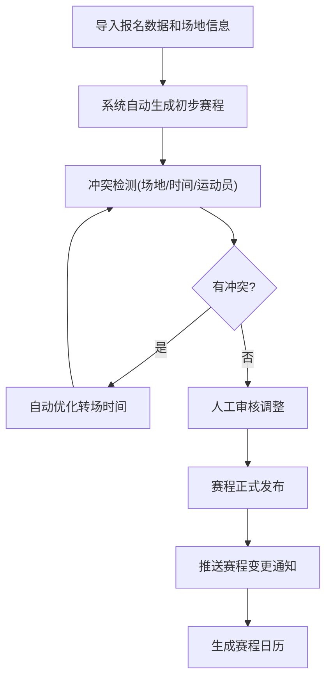
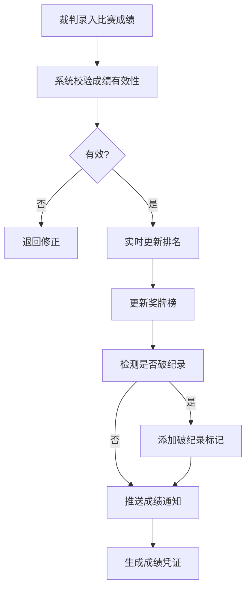
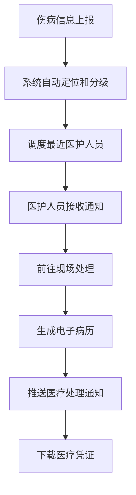

## 1. 产品概述
大型综合性运动会全流程赛事管理与智慧服务系统，实现从运动员注册、赛事编排、成绩管理、兴奋剂检测、志愿者调配、安保调度、票务销售到医疗保障的全流程数字化管理，为赛事组织者、运动员、观众等各方提供一体化智慧服务。
- 解决传统赛事管理中人工操作效率低、易出错、信息孤岛等问题
- 服务于赛事组委会、运动员、裁判、志愿者、安保人员、医护人员、观众等多类用户

## 2. 核心 Features

### 2.1 用户角色

| 角色 | 注册方式 | 核心权限 |
|------|----------|----------|
| 系统管理员 | 组委会授权 | 全局配置、用户管理、数据统计 |
| 运动员 | 在线注册+身份核验 | 个人信息管理、项目报名、成绩查询、消息接收 |
| 裁判 | 组委会录入 | 成绩上传、比赛判罚、证书下载 |
| 志愿者 | 在线注册+技能审核 | 岗位分配、签到打卡、服务时长统计 |
| 安保人员 | 组委会录入 | 巡逻路线查看、人流监控、异常上报 |
| 医护人员 | 组委会录入 | 伤病处理、电子病历、调度响应 |
| 观众 | 在线注册 | 购票选座、赛程查询、退票服务 |
| 反兴奋剂专员 | 组委会授权 | 抽检名单生成、检测结果录入、异常处理 |

### 2.2 Feature 模块

1. **首页仪表盘**：赛事总览、数据统计、实时消息、快捷入口
2. **运动员管理**：注册审核、年龄核验、项目分配、冲突检测
3. **赛事编排**：赛程生成、场地分配、冲突检测、转场优化
4. **成绩管理**：成绩录入、实时排名、奖牌榜、破纪录标记
5. **兴奋剂检测**：随机抽检、结果录入、异常锁定、复查流程
6. **志愿者管理**：注册审核、智能分配、签到打卡、时长统计
7. **安保管理**：热力图监控、路线生成、人流密度、实时调整
8. **票务系统**：在线购票、动态定价、座位管理、退票处理
9. **医疗保障**：伤病上报、医护调度、电子病历、药品管理
10. **消息中心**：实时推送、凭证下载、消息历史、通知设置

### 2.3 页面详情

| 页面名称 | 模块名称 | Feature 描述 |
|---------|----------|-------------|
| 首页仪表盘 | 数据概览 | 赛事进度、奖牌榜、实时人流、今日赛程、系统消息 |
| 首页仪表盘 | 快捷操作 | 快速跳转各功能模块、待办事项提醒 |
| 运动员注册 | 信息录入 | 基本信息、历史成绩、参赛项目、证件上传 |
| 运动员注册 | 智能核验 | 年龄自动计算、参赛资格核验、唯一ID生成 |
| 运动员注册 | 项目推荐 | 项目冲突检测、可调项目智能推荐 |
| 运动员列表 | 信息管理 | 运动员信息查看、编辑、审核、状态管理 |
| 赛事编排 | 赛程生成 | 自动生成赛程、场地时间分配、冲突检测与优化 |
| 赛事编排 | 赛程调整 | 手动调整赛程、批量更新、变更通知推送 |
| 赛程日历 | 赛程展示 | 日历视图、列表视图、场地视图、项目筛选 |
| 成绩录入 | 裁判操作 | 成绩上传、成绩审核、成绩修正、成绩确认 |
| 实时排名 | 排名展示 | 实时更新排名、分项排名、国家队排名 |
| 奖牌榜 | 奖牌统计 | 金/银/铜牌统计、国家/地区排名、破纪录标记 |
| 兴奋剂检测 | 抽检管理 | 随机抽检名单生成、检测计划、样本采集 |
| 兴奋剂检测 | 结果处理 | 检测结果录入、异常自动锁定、复查流程 |
| 志愿者注册 | 信息录入 | 基本信息、技能特长、可用时段、证件上传 |
| 志愿者管理 | 智能分配 | 技能匹配、时段匹配、岗位自动分配 |
| 志愿者管理 | 签到打卡 | 二维码签到、服务时长统计、服务评价 |
| 安保监控 | 热力图 | 实时人流热力图、人流密度监控、异常预警 |
| 安保管理 | 路线调度 | 巡逻路线自动生成、实时调整、人员位置追踪 |
| 票务购票 | 在线购票 | 赛程选择、座位预览、动态定价、在线支付 |
| 票务管理 | 订单管理 | 订单查询、退票申请、座位自动释放 |
| 医疗保障 | 伤病上报 | 伤病信息录入、位置上报、紧急程度分级 |
| 医疗保障 | 智能调度 | 最近医护调度、响应时间追踪、处理状态跟踪 |
| 医疗保障 | 电子病历 | 病历自动生成、药品记录、历史病历查询 |
| 消息中心 | 实时消息 | 注册成功、赛程变更、成绩通知、检测异常、门票变动、医疗处理 |
| 消息中心 | 凭证下载 | 参赛证、成绩单、门票、医疗凭证等PDF下载 |
| 个人中心 | 账户管理 | 个人信息、密码修改、通知设置、角色切换 |

## 3. 核心流程

### 运动员注册流程
运动员在线填写个人信息、历史成绩和参赛项目 → 系统自动计算年龄并核验参赛资格 → 生成唯一身份ID → 检测项目冲突 → 无冲突则注册成功并推送通知 → 有冲突则智能推荐可调项目 → 运动员确认后完成注册。

### 赛事编排流程
导入运动员报名数据 → 导入场地信息和可用时段 → 系统根据运动员参赛项数、场地可用时间、转场需求自动生成赛程 → 冲突检测与优化 → 人工审核调整 → 赛程发布 → 推送赛程通知。

### 成绩管理流程
比赛结束 → 裁判登录录入成绩 → 系统自动校验成绩有效性 → 实时更新排名 → 自动生成奖牌榜 → 检测是否破纪录 → 推送成绩通知 → 生成成绩凭证供下载。

### 医疗保障流程
伤病人员上报 → 系统自动定位位置并分级 → 调度最近医护人员 → 医护人员响应并前往处理 → 生成电子病历 → 推送医疗处理通知 → 相关人员下载医疗凭证。

## 4. 用户界面设计

### 4.1 设计风格
- **主色调**：深蓝色(#0A2463)代表专业与信任，金色(#D4AF37)代表荣耀与成就
- **辅助色**：科技蓝(#3E92CC)、活力橙(#F77F00)、成功绿(#38B000)、警示红(#D62828)
- **按钮风格**：圆角8px，渐变色填充，悬停微放大效果，点击反馈动画
- **字体**：标题使用"Chakra Petch"等宽科技字体，正文使用"Noto Sans SC"优雅无衬线字体
- **布局风格**：卡片式布局、左侧导航栏、顶部状态栏、网格系统
- **图标风格**：线性图标搭配渐变背景，运动元素融入设计

### 4.2 页面设计概览

| 页面名称 | 模块名称 | UI 元素 |
|---------|----------|----------|
| 首页仪表盘 | 数据概览 | 大屏数据看板、渐变统计卡片、实时折线图、环形奖牌榜、热力图 |
| 运动员注册 | 表单设计 | 分步引导、多步骤进度条、智能提示、自动计算年龄、项目标签 |
| 赛事编排 | 时间轴 | 甘特图视图、拖拽调整、冲突高亮、转场时间标记 |
| 实时排名 | 排行榜 | 金色/银色/铜色奖牌图标、动态更新动画、国家旗帜、破纪录徽章 |
| 安保监控 | 热力图 | 地图热力图层、人流密度色阶、巡逻路线动画、人员位置标记 |
| 票务购票 | 选座界面 | 3D座位图、座位状态颜色编码、价格动态显示、购票动效 |
| 消息中心 | 通知列表 | 消息分类标签、未读红点、凭证下载按钮、实时推送动画 |
| 医疗保障 | 调度界面 | 地图定位、医护人员状态、紧急程度色标、处理时间线 |

### 4.3 响应式设计
- 采用桌面端优先设计，适配1920px、1440px、1024px主流分辨率
- 平板端：导航栏折叠为图标模式，卡片自适应两列布局
- 移动端：底部导航栏，单列卡片布局，触控优化，手势操作支持
- 关键页面支持全屏模式，便于大屏展示

### 4.4 视觉动效
- 页面加载：元素渐入+位移动画，错落延迟效果
- 数据更新：数字滚动动画、奖牌榜升降动画
- 实时监控：热力图流动效果、人员位置轨迹动画
- 交互反馈：按钮悬停放大、卡片浮起阴影、表单验证震动
- 通知推送：顶部滑入动画、消息铃声提示
