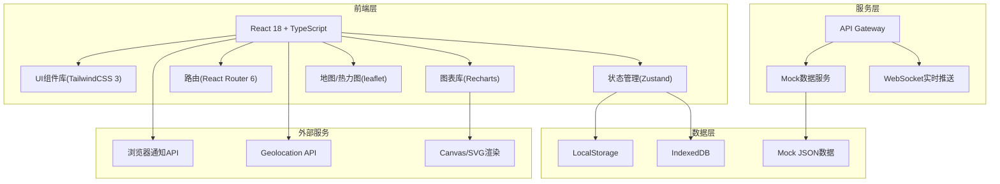
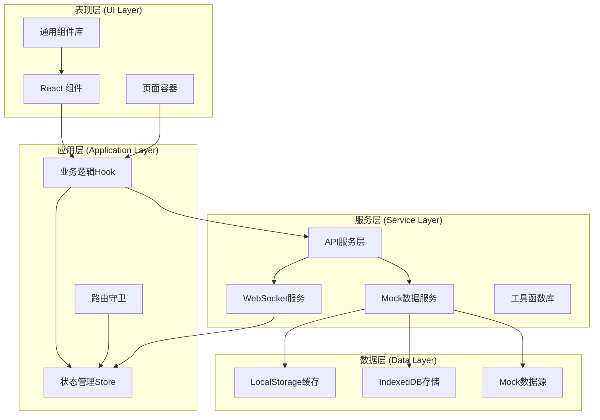
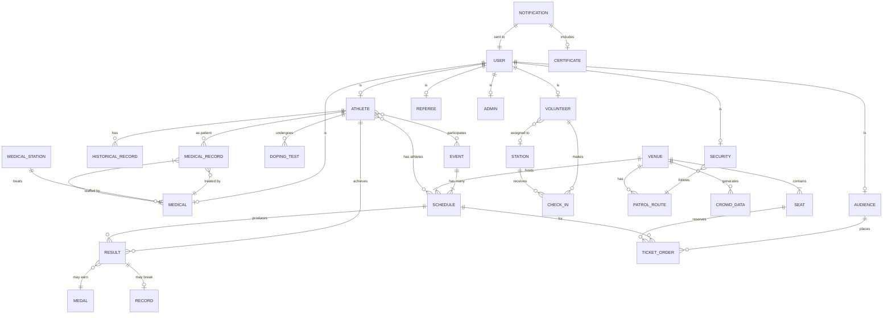

## 1. 架构设计



## 2. 技术描述

- **前端框架**：React@18.2.0 + TypeScript@5.3.0
- **初始化工具**：Vite@5.0.0
- **样式方案**：TailwindCSS@3.4.0 + PostCSS + Autoprefixer
- **状态管理**：Zustand@4.4.0（轻量高性能状态管理）
- **路由方案**：React Router@6.20.0
- **图表可视化**：Recharts@2.10.0（折线图、柱状图、饼图）
- **地图与热力图**：Leaflet@1.9.0 + heatmap.js
- **UI组件**：Headless UI@1.7.0（无样式组件库）+ Heroicons
- **动画库**：Framer Motion@10.16.0（交互动画）
- **表单处理**：React Hook Form@7.48.0 + Zod@3.22.0（表单验证）
- **日期处理**：date-fns@3.0.0
- **ID生成**：uuid@9.0.0
- **后端**：无，前端内置Mock数据服务
- **数据库**：LocalStorage + IndexedDB（浏览器存储）+ Mock JSON数据
- **代码规范**：ESLint + Prettier

## 3. 路由定义

| 路由路径 | 页面名称 | 权限角色 | 说明 |
|---------|---------|---------|------|
| / | 登录页 | 公开 | 用户登录入口，支持角色选择 |
| /dashboard | 首页仪表盘 | 所有登录用户 | 数据总览、快捷操作 |
| /athlete/register | 运动员注册 | 公开/运动员 | 运动员在线注册表单 |
| /athlete/list | 运动员列表 | 管理员/裁判 | 运动员信息管理 |
| /athlete/profile | 运动员个人中心 | 运动员 | 个人信息、参赛项目、成绩 |
| /schedule/generate | 赛事编排 | 管理员 | 自动生成赛程、冲突检测 |
| /schedule/calendar | 赛程日历 | 所有用户 | 赛程展示、多视图切换 |
| /result/entry | 成绩录入 | 裁判 | 比赛成绩上传 |
| /result/ranking | 实时排名 | 所有用户 | 实时更新排名榜 |
| /result/medal | 奖牌榜 | 所有用户 | 国家/地区奖牌统计 |
| /doping/test | 兴奋剂抽检 | 反兴奋剂专员 | 随机抽检名单生成 |
| /doping/result | 检测结果 | 反兴奋剂专员 | 检测结果录入、异常处理 |
| /volunteer/register | 志愿者注册 | 公开 | 志愿者在线注册 |
| /volunteer/manage | 志愿者管理 | 管理员 | 岗位分配、签到管理 |
| /volunteer/checkin | 志愿者签到 | 志愿者 | 签到打卡、服务时长 |
| /security/heatmap | 安保热力图 | 管理员/安保 | 实时人流热力监控 |
| /security/patrol | 巡逻路线 | 安保人员 | 巡逻路线查看、调整 |
| /ticket/buy | 购票选座 | 观众 | 在线购票、动态定价 |
| /ticket/order | 订单管理 | 观众 | 订单查询、退票 |
| /medical/report | 伤病上报 | 所有用户 | 伤病信息上报 |
| /medical/dispatch | 医疗调度 | 医护/管理员 | 医护调度、电子病历 |
| /messages | 消息中心 | 所有登录用户 | 实时消息、凭证下载 |
| /profile | 个人中心 | 所有登录用户 | 账户管理、通知设置 |

## 4. API 定义

### 4.1 TypeScript 类型定义

```typescript
// 用户基础类型
interface User {
  id: string;
  username: string;
  role: 'admin' | 'athlete' | 'referee' | 'volunteer' | 'security' | 'medical' | 'audience' | 'doping';
  name: string;
  email: string;
  phone: string;
  avatar?: string;
  createdAt: string;
  status: 'active' | 'inactive';
}

// 运动员类型
interface Athlete extends User {
  athleteId: string;
  birthDate: string;
  age: number;
  gender: 'male' | 'female';
  country: string;
  countryCode: string;
  events: string[];
  historicalRecords: Record[];
  status: 'pending' | 'approved' | 'rejected';
}

// 历史成绩
interface Record {
  id: string;
  eventId: string;
  eventName: string;
  result: string;
  date: string;
  competition: string;
  isRecord: boolean;
}

// 比赛项目
interface Event {
  id: string;
  name: string;
  category: string;
  gender: 'male' | 'female' | 'mixed';
  ageMin: number;
  ageMax: number;
  venueId: string;
  status: 'upcoming' | 'ongoing' | 'completed';
}

// 赛程
interface Schedule {
  id: string;
  eventId: string;
  eventName: string;
  venueId: string;
  venueName: string;
  startTime: string;
  endTime: string;
  date: string;
  round: string;
  athletes: string[];
  status: 'scheduled' | 'ongoing' | 'completed' | 'cancelled';
  transitionTime: number;
}

// 场地
interface Venue {
  id: string;
  name: string;
  type: string;
  capacity: number;
  location: { lat: number; lng: number };
  availableTimeSlots: TimeSlot[];
}

// 比赛成绩
interface Result {
  id: string;
  scheduleId: string;
  athleteId: string;
  athleteName: string;
  country: string;
  result: string;
  rank: number;
  medal?: 'gold' | 'silver' | 'bronze';
  isRecord: boolean;
  recordType?: 'world' | 'olympic' | 'national';
  refereeId: string;
  createdAt: string;
  status: 'pending' | 'confirmed' | 'locked';
}

// 奖牌榜
interface MedalStanding {
  country: string;
  countryCode: string;
  gold: number;
  silver: number;
  bronze: number;
  total: number;
  rank: number;
}

// 兴奋剂检测
interface DopingTest {
  id: string;
  athleteId: string;
  athleteName: string;
  scheduleId: string;
  testType: 'random' | 'targeted';
  sampleType: 'blood' | 'urine';
  sampleCollectedAt: string;
  result: 'pending' | 'negative' | 'positive' | 'abnormal';
  testedAt?: string;
  isLocked: boolean;
  notes?: string;
}

// 志愿者
interface Volunteer extends User {
  skills: string[];
  availableSlots: TimeSlot[];
  assignedStation?: string;
  totalServiceHours: number;
  checkIns: CheckIn[];
}

// 签到记录
interface CheckIn {
  id: string;
  volunteerId: string;
  stationId: string;
  checkInTime: string;
  checkOutTime?: string;
  duration?: number;
}

// 安保人员
interface SecurityPersonnel extends User {
  currentPatrolRoute?: string;
  currentLocation?: { lat: number; lng: number };
  status: 'idle' | 'patrolling' | 'emergency';
}

// 人流数据
interface CrowdData {
  venueId: string;
  timestamp: string;
  density: number;
  heatmapData: HeatmapPoint[];
}

// 票务订单
interface TicketOrder {
  id: string;
  audienceId: string;
  scheduleId: string;
  seatId: string;
  seatInfo: string;
  price: number;
  originalPrice: number;
  purchaseTime: string;
  status: 'paid' | 'refunded' | 'cancelled';
  qrCode?: string;
}

// 座位
interface Seat {
  id: string;
  venueId: string;
  section: string;
  row: string;
  number: string;
  status: 'available' | 'sold' | 'reserved';
  priceTier: 'VIP' | 'A' | 'B' | 'C';
  dynamicPrice: number;
}

// 医疗记录
interface MedicalRecord {
  id: string;
  patientId: string;
  patientType: 'athlete' | 'audience' | 'staff' | 'volunteer';
  patientName: string;
  location: { lat: number; lng: number; description: string };
  injuryType: string;
  severity: 'mild' | 'moderate' | 'severe' | 'critical';
  symptoms: string;
  assignedMedicalId?: string;
  responseTime?: number;
  treatment: string;
  medications: string[];
  status: 'reported' | 'dispatched' | 'processing' | 'completed';
  createdAt: string;
  completedAt?: string;
}

// 消息通知
interface Notification {
  id: string;
  recipientId: string;
  type: 'registration' | 'schedule' | 'result' | 'doping' | 'ticket' | 'medical' | 'system';
  title: string;
  content: string;
  relatedEntityId?: string;
  relatedEntityType?: string;
  certificateUrl?: string;
  isRead: boolean;
  createdAt: string;
}

// 时间段
interface TimeSlot {
  date: string;
  startTime: string;
  endTime: string;
}

// 热力图点
interface HeatmapPoint {
  lat: number;
  lng: number;
  value: number;
}
```

### 4.2 API 接口定义

```typescript
// 运动员模块
interface AthleteAPI {
  register(data: Omit<Athlete, 'id' | 'athleteId' | 'age' | 'status' | 'createdAt'>): Promise<{ success: boolean; athlete: Athlete; conflicts?: string[]; suggestions?: string[] }>;
  verifyAge(birthDate: string, eventIds: string[]): Promise<{ valid: boolean; issues: string[] }>;
  checkEventConflicts(athleteId: string, eventIds: string[]): Promise<{ hasConflict: boolean; conflicts: Conflict[]; suggestions: string[] }>;
  generateAthleteId(countryCode: string): Promise<string>;
  list(params?: { country?: string; event?: string; status?: string }): Promise<Athlete[]>;
  get(id: string): Promise<Athlete>;
}

// 赛事编排模块
interface ScheduleAPI {
  generate(events: string[], venues: string[]): Promise<{ schedules: Schedule[]; conflicts: string[]; warnings: string[] }>;
  detectConflicts(schedules: Schedule[]): Promise<Conflict[]>;
  optimizeTransitions(schedules: Schedule[]): Promise<Schedule[]>;
  list(params?: { date?: string; venue?: string; event?: string }): Promise<Schedule[]>;
  update(id: string, data: Partial<Schedule>): Promise<Schedule>;
  publish(scheduleIds: string[]): Promise<boolean>;
}

// 成绩管理模块
interface ResultAPI {
  submit(data: Omit<Result, 'id' | 'isRecord' | 'rank' | 'medal' | 'createdAt'>): Promise<Result>;
  getRanking(eventId: string): Promise<Result[]>;
  getMedalStanding(): Promise<MedalStanding[]>;
  checkRecord(result: Result, eventId: string): Promise<{ isRecord: boolean; recordType?: string }>;
  confirm(id: string): Promise<Result>;
  lock(id: string, reason: string): Promise<Result>;
}

// 兴奋剂检测模块
interface DopingAPI {
  generateRandomTests(eventId: string, count: number): Promise<DopingTest[]>;
  submitResult(id: string, result: DopingTest['result'], notes?: string): Promise<DopingTest>;
  lockAthleteResult(athleteId: string, testId: string): Promise<boolean>;
  list(params?: { athleteId?: string; result?: string }): Promise<DopingTest[]>;
}

// 志愿者模块
interface VolunteerAPI {
  register(data: Omit<Volunteer, 'id' | 'totalServiceHours' | 'checkIns' | 'createdAt'>): Promise<Volunteer>;
  autoAssign(volunteerIds: string[]): Promise<AssignResult[]>;
  checkIn(volunteerId: string, stationId: string): Promise<CheckIn>;
  checkOut(checkInId: string): Promise<CheckIn>;
  getServiceHours(volunteerId: string): Promise<number>;
}

// 安保模块
interface SecurityAPI {
  getHeatmapData(venueId: string): Promise<CrowdData>;
  generatePatrolRoute(venueId: string, personnelId: string): Promise<PatrolRoute>;
  adjustPatrolRoute(routeId: string, crowdData: CrowdData): Promise<PatrolRoute>;
  updateLocation(personnelId: string, location: { lat: number; lng: number }): Promise<void>;
}

// 票务模块
interface TicketAPI {
  getDynamicPrice(scheduleId: string, seatId: string): Promise<number>;
  getAvailableSeats(scheduleId: string): Promise<Seat[]>;
  purchase(scheduleId: string, seatIds: string[], audienceId: string): Promise<TicketOrder[]>;
  refund(orderId: string): Promise<boolean>;
  listOrders(audienceId: string): Promise<TicketOrder[]>;
}

// 医疗模块
interface MedicalAPI {
  reportInjury(data: Omit<MedicalRecord, 'id' | 'status' | 'createdAt'>): Promise<MedicalRecord>;
  dispatchNearestMedical(recordId: string): Promise<{ medicalId: string; eta: number }>;
  updateRecord(id: string, data: Partial<MedicalRecord>): Promise<MedicalRecord>;
  getRecords(patientId?: string): Promise<MedicalRecord[]>;
}

// 消息通知模块
interface NotificationAPI {
  push(notification: Omit<Notification, 'id' | 'isRead' | 'createdAt'>): Promise<Notification>;
  list(userId: string): Promise<Notification[]>;
  markAsRead(id: string): Promise<boolean>;
  generateCertificate(type: string, entityId: string): Promise<string>;
}

// 冲突类型
interface Conflict {
  type: 'time' | 'venue' | 'athlete' | 'age';
  description: string;
  affectedEntities: string[];
  severity: 'error' | 'warning';
}

// 分配结果
interface AssignResult {
  volunteerId: string;
  stationId: string;
  matchScore: number;
  reason: string;
}

// 巡逻路线
interface PatrolRoute {
  id: string;
  personnelId: string;
  venueId: string;
  waypoints: { lat: number; lng: number }[];
  estimatedDuration: number;
  generatedAt: string;
}
```

## 5. 服务端架构图（逻辑分层）



## 6. 数据模型

### 6.1 ER 图



### 6.2 数据初始化脚本

```typescript
// Mock 数据初始化
export const mockVenues: Venue[] = [
  {
    id: 'v001',
    name: '主体育场',
    type: '田径场',
    capacity: 80000,
    location: { lat: 39.9042, lng: 116.4074 },
    availableTimeSlots: [
      { date: '2026-06-10', startTime: '08:00', endTime: '22:00' },
      { date: '2026-06-11', startTime: '08:00', endTime: '22:00' }
    ]
  },
  {
    id: 'v002',
    name: '游泳馆',
    type: '游泳馆',
    capacity: 15000,
    location: { lat: 39.9142, lng: 116.4174 },
    availableTimeSlots: [
      { date: '2026-06-10', startTime: '09:00', endTime: '21:00' }
    ]
  }
];

export const mockEvents: Event[] = [
  {
    id: 'e001',
    name: '男子100米自由泳',
    category: '游泳',
    gender: 'male',
    ageMin: 14,
    ageMax: 40,
    venueId: 'v002',
    status: 'upcoming'
  },
  {
    id: 'e002',
    name: '女子100米自由泳',
    category: '游泳',
    gender: 'female',
    ageMin: 14,
    ageMax: 40,
    venueId: 'v002',
    status: 'upcoming'
  },
  {
    id: 'e003',
    name: '男子100米短跑',
    category: '田径',
    gender: 'male',
    ageMin: 16,
    ageMax: 40,
    venueId: 'v001',
    status: 'upcoming'
  }
];

export const mockAthletes: Athlete[] = [
  {
    id: 'a001',
    username: 'zhangwei',
    role: 'athlete',
    name: '张伟',
    email: 'zhangwei@example.com',
    phone: '13800138001',
    athleteId: 'CHN-2026-0001',
    birthDate: '2000-05-15',
    age: 26,
    gender: 'male',
    country: '中国',
    countryCode: 'CHN',
    events: ['e001'],
    historicalRecords: [],
    status: 'approved',
    createdAt: '2026-01-10T00:00:00Z'
  }
];

export const mockSchedules: Schedule[] = [
  {
    id: 's001',
    eventId: 'e001',
    eventName: '男子100米自由泳',
    venueId: 'v002',
    venueName: '游泳馆',
    startTime: '2026-06-10T09:00:00Z',
    endTime: '2026-06-10T10:00:00Z',
    date: '2026-06-10',
    round: '预赛',
    athletes: ['a001'],
    status: 'scheduled',
    transitionTime: 15
  }
];

export const mockMedalStanding: MedalStanding[] = [
  { country: '中国', countryCode: 'CHN', gold: 15, silver: 10, bronze: 8, total: 33, rank: 1 },
  { country: '美国', countryCode: 'USA', gold: 12, silver: 14, bronze: 10, total: 36, rank: 2 },
  { country: '日本', countryCode: 'JPN', gold: 8, silver: 6, bronze: 9, total: 23, rank: 3 }
];

export const mockNotifications: Notification[] = [
  {
    id: 'n001',
    recipientId: 'a001',
    type: 'registration',
    title: '注册成功',
    content: '您的运动员注册已审核通过，参赛ID为CHN-2026-0001',
    isRead: false,
    createdAt: '2026-01-10T00:00:00Z'
  }
];
```
